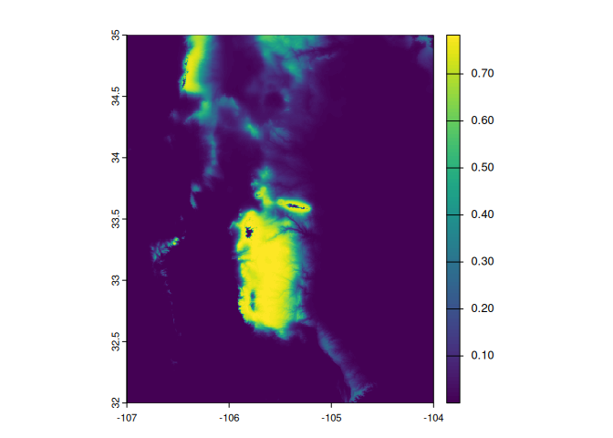

<!-- README.md is generated from README.Rmd. Please edit that file -->

# xsdm

<!-- badges: start -->

<!-- badges: end -->

xsdm: A demographic approach to species distribution model

## Installation

`xsdm` relies on cmdstanr package. Please install first this package tha
is not in cran with the following code:

``` r
install.packages("cmdstanr", repos = c('https://stan-dev.r-universe.dev', getOption("repos")))
```

Following this you need to install cmdstan

``` r
cmdstanr::install_cmdstan()
```

After this, you can install the development version of xsdm from
[GitHub](https://github.com/alrobles/xsdm/) with:

``` r
remotes::install_github("alrobles/xsdm")
```

## Quick Start

We provide here a basic example to get a species distribution model
(SDM) using `xsdm`.

### First step

The first step is to create a list with the raster stack of
environmental time series of variables. These example rasters are
packaged for distribution with the `xsdm` package. We use the
`terra::rast` function to convert a data frame in a time series raster.

``` r
library(xsdm)
#> Package 'xsdm' version 0.2.1
#> Type 'citation("xsdm")' for citing this R package in publications.
#> 
#> This package depends on cmdstanr that is not in CRAN
library(terra)
#> terra 1.8.54
bio1 <- xsdm::bio1_df 
bio1 <- terra::rast(bio1)
```

These correspond to a 30-year time series of the bioclimatic variables
bio1 (average annual temperature) and bio12 (cumulative annual
precipitation) obtained from the project `CHELSA` (Climatologies at high
resolution for the earth’s land surface areas) that we get from
<https://chelsa-climate.org/>.

### Second step

We create a list of this time series. In this first example we use one
variables but is possible to use 2, 3 or more variables. This is
depending on the model. But the computation time increase with the
number of parameters the model fits. We recomend to name the elements of
the list with the environmental variable name

``` r
envData <- list(bio1 = bio1)
```

### Third step

The next step is to set a `data.frame` with presence points of a species
of interest you want to model.

``` r
occ <- xsdm::mus_virtualis
```

In this example we provide a virtual species. Later we will show how to
create these virtual species. The structure of the `data.frame` should
be a table with 4 columns with the following structure:

- *name*: The name of the taxon to model
- *longitude*: longitude in decimals
- *latitude*: latitude in decimals
- *presence*: Presence or absence value

Disclaimer: We provided limited documentation in how to download and
clean data, however the main focus of `xsdm` is the modeling of species
distribution. From the design philosophy of the package, it is the
user’s responsibility to provide correct input data.

### Fourth step

Get our very own first model is pretty straight foward using the
function `xsdm`:

``` r
model <- xsdm(envData, occ)
#> Running MCMC with 4 sequential chains...
#> 
#> Chain 1 Iteration:    1 / 2000 [  0%]  (Warmup) 
#> Chain 1 Iteration:  100 / 2000 [  5%]  (Warmup) 
#> Chain 1 Iteration:  200 / 2000 [ 10%]  (Warmup) 
#> Chain 1 Iteration:  300 / 2000 [ 15%]  (Warmup) 
#> Chain 1 Iteration:  400 / 2000 [ 20%]  (Warmup) 
#> Chain 1 Iteration:  500 / 2000 [ 25%]  (Warmup) 
#> Chain 1 Iteration:  600 / 2000 [ 30%]  (Warmup) 
#> Chain 1 Iteration:  700 / 2000 [ 35%]  (Warmup) 
#> Chain 1 Iteration:  800 / 2000 [ 40%]  (Warmup) 
#> Chain 1 Iteration:  900 / 2000 [ 45%]  (Warmup) 
#> Chain 1 Iteration: 1000 / 2000 [ 50%]  (Warmup) 
#> Chain 1 Iteration: 1001 / 2000 [ 50%]  (Sampling) 
#> Chain 1 Iteration: 1100 / 2000 [ 55%]  (Sampling) 
#> Chain 1 Iteration: 1200 / 2000 [ 60%]  (Sampling) 
#> Chain 1 Iteration: 1300 / 2000 [ 65%]  (Sampling) 
#> Chain 1 Iteration: 1400 / 2000 [ 70%]  (Sampling) 
#> Chain 1 Iteration: 1500 / 2000 [ 75%]  (Sampling) 
#> Chain 1 Iteration: 1600 / 2000 [ 80%]  (Sampling) 
#> Chain 1 Iteration: 1700 / 2000 [ 85%]  (Sampling) 
#> Chain 1 Iteration: 1800 / 2000 [ 90%]  (Sampling) 
#> Chain 1 Iteration: 1900 / 2000 [ 95%]  (Sampling) 
#> Chain 1 Iteration: 2000 / 2000 [100%]  (Sampling) 
#> Chain 1 finished in 5.5 seconds.
#> Chain 2 Iteration:    1 / 2000 [  0%]  (Warmup) 
#> Chain 2 Iteration:  100 / 2000 [  5%]  (Warmup) 
#> Chain 2 Iteration:  200 / 2000 [ 10%]  (Warmup) 
#> Chain 2 Iteration:  300 / 2000 [ 15%]  (Warmup) 
#> Chain 2 Iteration:  400 / 2000 [ 20%]  (Warmup) 
#> Chain 2 Iteration:  500 / 2000 [ 25%]  (Warmup) 
#> Chain 2 Iteration:  600 / 2000 [ 30%]  (Warmup) 
#> Chain 2 Iteration:  700 / 2000 [ 35%]  (Warmup) 
#> Chain 2 Iteration:  800 / 2000 [ 40%]  (Warmup) 
#> Chain 2 Iteration:  900 / 2000 [ 45%]  (Warmup) 
#> Chain 2 Iteration: 1000 / 2000 [ 50%]  (Warmup) 
#> Chain 2 Iteration: 1001 / 2000 [ 50%]  (Sampling) 
#> Chain 2 Iteration: 1100 / 2000 [ 55%]  (Sampling) 
#> Chain 2 Iteration: 1200 / 2000 [ 60%]  (Sampling) 
#> Chain 2 Iteration: 1300 / 2000 [ 65%]  (Sampling) 
#> Chain 2 Iteration: 1400 / 2000 [ 70%]  (Sampling) 
#> Chain 2 Iteration: 1500 / 2000 [ 75%]  (Sampling) 
#> Chain 2 Iteration: 1600 / 2000 [ 80%]  (Sampling) 
#> Chain 2 Iteration: 1700 / 2000 [ 85%]  (Sampling) 
#> Chain 2 Iteration: 1800 / 2000 [ 90%]  (Sampling) 
#> Chain 2 Iteration: 1900 / 2000 [ 95%]  (Sampling) 
#> Chain 2 Iteration: 2000 / 2000 [100%]  (Sampling) 
#> Chain 2 finished in 5.9 seconds.
#> Chain 3 Iteration:    1 / 2000 [  0%]  (Warmup) 
#> Chain 3 Iteration:  100 / 2000 [  5%]  (Warmup) 
#> Chain 3 Iteration:  200 / 2000 [ 10%]  (Warmup) 
#> Chain 3 Iteration:  300 / 2000 [ 15%]  (Warmup) 
#> Chain 3 Iteration:  400 / 2000 [ 20%]  (Warmup) 
#> Chain 3 Iteration:  500 / 2000 [ 25%]  (Warmup) 
#> Chain 3 Iteration:  600 / 2000 [ 30%]  (Warmup) 
#> Chain 3 Iteration:  700 / 2000 [ 35%]  (Warmup) 
#> Chain 3 Iteration:  800 / 2000 [ 40%]  (Warmup) 
#> Chain 3 Iteration:  900 / 2000 [ 45%]  (Warmup) 
#> Chain 3 Iteration: 1000 / 2000 [ 50%]  (Warmup) 
#> Chain 3 Iteration: 1001 / 2000 [ 50%]  (Sampling) 
#> Chain 3 Iteration: 1100 / 2000 [ 55%]  (Sampling) 
#> Chain 3 Iteration: 1200 / 2000 [ 60%]  (Sampling) 
#> Chain 3 Iteration: 1300 / 2000 [ 65%]  (Sampling) 
#> Chain 3 Iteration: 1400 / 2000 [ 70%]  (Sampling) 
#> Chain 3 Iteration: 1500 / 2000 [ 75%]  (Sampling) 
#> Chain 3 Iteration: 1600 / 2000 [ 80%]  (Sampling) 
#> Chain 3 Iteration: 1700 / 2000 [ 85%]  (Sampling) 
#> Chain 3 Iteration: 1800 / 2000 [ 90%]  (Sampling) 
#> Chain 3 Iteration: 1900 / 2000 [ 95%]  (Sampling) 
#> Chain 3 Iteration: 2000 / 2000 [100%]  (Sampling) 
#> Chain 3 finished in 7.4 seconds.
#> Chain 4 Iteration:    1 / 2000 [  0%]  (Warmup) 
#> Chain 4 Iteration:  100 / 2000 [  5%]  (Warmup) 
#> Chain 4 Iteration:  200 / 2000 [ 10%]  (Warmup) 
#> Chain 4 Iteration:  300 / 2000 [ 15%]  (Warmup) 
#> Chain 4 Iteration:  400 / 2000 [ 20%]  (Warmup) 
#> Chain 4 Iteration:  500 / 2000 [ 25%]  (Warmup) 
#> Chain 4 Iteration:  600 / 2000 [ 30%]  (Warmup) 
#> Chain 4 Iteration:  700 / 2000 [ 35%]  (Warmup) 
#> Chain 4 Iteration:  800 / 2000 [ 40%]  (Warmup) 
#> Chain 4 Iteration:  900 / 2000 [ 45%]  (Warmup) 
#> Chain 4 Iteration: 1000 / 2000 [ 50%]  (Warmup) 
#> Chain 4 Iteration: 1001 / 2000 [ 50%]  (Sampling) 
#> Chain 4 Iteration: 1100 / 2000 [ 55%]  (Sampling) 
#> Chain 4 Iteration: 1200 / 2000 [ 60%]  (Sampling) 
#> Chain 4 Iteration: 1300 / 2000 [ 65%]  (Sampling) 
#> Chain 4 Iteration: 1400 / 2000 [ 70%]  (Sampling) 
#> Chain 4 Iteration: 1500 / 2000 [ 75%]  (Sampling) 
#> Chain 4 Iteration: 1600 / 2000 [ 80%]  (Sampling) 
#> Chain 4 Iteration: 1700 / 2000 [ 85%]  (Sampling) 
#> Chain 4 Iteration: 1800 / 2000 [ 90%]  (Sampling) 
#> Chain 4 Iteration: 1900 / 2000 [ 95%]  (Sampling) 
#> Chain 4 Iteration: 2000 / 2000 [100%]  (Sampling) 
#> Chain 4 finished in 5.5 seconds.
#> 
#> All 4 chains finished successfully.
#> Mean chain execution time: 6.1 seconds.
#> Total execution time: 24.6 seconds.
#> Warning: 139 of 4000 (3.0%) transitions ended with a divergence.
#> See https://mc-stan.org/misc/warnings for details.
```

In the design of xsdm we simplify the use with a main `xsdm` function.
Innerlly this function controls the model flow.

## What is xsdm

`xsdm` integrates concepts of stochastic demography into species
distribution modelling. Inferences, utilizing Bayesian methods based in
‘Stan’, are made of aspects of the environmental niche of a species, and
those inferences can be used to project species geographic range. See
Berti et al. (2024, <doi:10.1101/2024.10.30.621023>) for a description
of the statistical and demographic models used.

## Virtual species

In order to follow with more examples we provide an auxiliary data
package with examples to show the xsdm funcionalities.

``` r
install.packages("xsdmexamples", repos="https://alrobles.github.io/drat/")
```

Then we create a raster list with two environmental variables. This
example is centered in a small portion of South New Mexico with 1 km^2
of spatial resolution.

``` r

library(xsdmexamples)
library(terra)
bio1 <- terra::rast(bio1_df_NM)
bio12 <- terra::rast(bio12_df_NM)

envData <- list(bio1 = bio1, bio12 = bio12)
```

We are going to create a virtual species with the function `vsp`.

``` r
library(xsdm)
virt_rast <- vsp(env_data = envData, 
                 param.list = list(mu = c(8, 700), 
                                sigl = c(1, 100),
                                sigr = c(2, 50),
                                c = -5,
                                pd = 0.8,
                                L = matrix(c(1,0,0,1), ncol = 2) ))
```

``` r
library(terra)
plot(virt_rast)
```



Then we are going to create a random sample of points from this virtual
species

``` r

df_presence <- terra::spatSample(virt_rast, 1000, na.rm = TRUE, xy = TRUE)
#> Warning: [is.lonlat] assuming lon/lat crs

names(df_presence) <- c("longitude", "latitude", "probs")

df_presence$presence <- rbinom(nrow(df_presence),
                               size = 1,
                               prob = df_presence$probs)
```

Let’s run a model to test that `xsdm` can retrieve the parameters we
created the virtual species with.

``` r
model <- xsdm(envData, df_presence,
              recompile = TRUE,
              max_treedepth = 10,
              adapt_delta = 0.8,
              nchains = 4,
              parallel_chains = 4,
              threads_per_chain = 5,
              iter_warmup = 500,
              iter_sampling = 500,
              refresh = 10)
```
